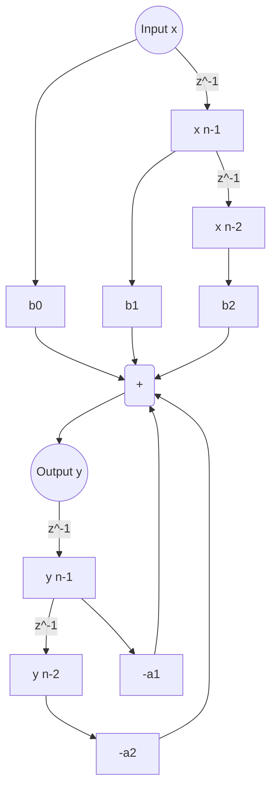

# Biquad Filter Cascades

**Tags:** #DSP #AudioProgramming #Filters #Cpp #EQ

---

## 1. The Concept: The "Lego Brick" of EQ

**Definition:**
A **Biquad** (Bi-Quadratic) filter is a 2nd-order recursive linear filter. It is the fundamental building block of digital audio equalization.

**The Analogy: The Spring & Mass**
- **1st Order (Leaky Integrator):** A shock absorber. It dampens energy. No bounce.
- **2nd Order (Biquad):** A mass on a spring. It can "resonate" or "ring." This property allows for:
    - **Q (Resonance):** Boosting frequencies at the cutoff point.
    - **Notches:** Surgical removal of specific frequencies.
    - **Steepness:** 12dB/octave slope per biquad.

**Why Cascade?**
A single Biquad provides a 12dB/octave slope. To get "modern" steep filtering (24dB, 48dB, 96dB), we do not build complex higher-order equations. We simply **chain** (cascade) Biquads together.
* *Linkwitz-Riley 4th Order (24dB/oct)* = Two Biquads in series.

---

## 2. The Math: Direct Form I

We use the **Direct Form I** topology. It requires more memory (4 history states) than Direct Form II, but it is the industry standard for floating-point audio because it is less susceptible to numerical noise and overflow.

### The Transfer Function (Z-Domain)
$$H(z) = \frac{b_0 + b_1 z^{-1} + b_2 z^{-2}}{1 + a_1 z^{-1} + a_2 z^{-2}}$$

### The Difference Equation (Time-Domain)
This is the instruction set for the CPU:
$$y[n] = b_0 x[n] + b_1 x[n-1] + b_2 x[n-2] - a_1 y[n-1] - a_2 y[n-2]$$

**Components:**
- **Feedforward ($b$ coeffs):** Zeros. They control the "dip" or nulls.
- **Feedback ($a$ coeffs):** Poles. They control the "peak" or resonance.
- **Delays ($z^{-1}, z^{-2}$):** The memory of the past two samples.

---

## 3. Signal Flow Graph (Mermaid)

This diagram visualizes the **Direct Form I** structure. Notice the clear separation of the Input history (left) and Output history (right).



## 4. Implementation (C++20)

**File:** `implementations/04_biquad_cascade.h`

This implementation separates the _Coefficients_ (Data) from the _Filter_ (Logic), allowing easy updates.

```
#pragma once
#include <vector>

// 1. The Data Container
struct BiquadCoeffs {
    double b0 = 1.0, b1 = 0.0, b2 = 0.0;
    double a1 = 0.0, a2 = 0.0;
};

// 2. The Single Unit (The Engine)
class Biquad {
public:
    void setCoeffs(const BiquadCoeffs& coeffs) { m_coeffs = coeffs; }
    
    void reset() {
        m_x1 = m_x2 = 0.0;
        m_y1 = m_y2 = 0.0;
    }

    [[nodiscard]] double process(double x) noexcept {
        // Direct Form I Equation
        double y = m_coeffs.b0 * x 
                 + m_coeffs.b1 * m_x1 
                 + m_coeffs.b2 * m_x2 
                 - m_coeffs.a1 * m_y1 
                 - m_coeffs.a2 * m_y2;

        // Shift Memory (Bucket Brigade)
        m_x2 = m_x1; m_x1 = x;
        m_y2 = m_y1; m_y1 = y;

        return y;
    }

private:
    BiquadCoeffs m_coeffs;
    double m_x1 = 0.0, m_x2 = 0.0; // Input History
    double m_y1 = 0.0, m_y2 = 0.0; // Output History
};

// 3. The Manager (The Cascade)
class BiquadCascade {
public:
    void addBiquad(const BiquadCoeffs& coeffs) {
        Biquad bq;
        bq.setCoeffs(coeffs);
        m_stages.push_back(bq);
    }
    
    void reset() {
        for(auto& s : m_stages) s.reset();
    }

    [[nodiscard]] double process(double x) noexcept {
        double temp = x;
        // Output of Stage 1 -> Input of Stage 2
        for (auto& stage : m_stages) {
            temp = stage.process(temp);
        }
        return temp;
    }

private:
    std::vector<Biquad> m_stages;
};
```

## 5. Visualizer Expectations

### Single Biquad (Low Pass)

- **Slope:** You will see the frequencies roll off steadily.
    
- **The Knee:** If Q > 0.707, you will see a small "bump" in volume right before the drop-off frequency. This is resonance.
    

### Cascaded Biquad (2x Stages)

- **Slope:** The drop-off becomes a vertical cliff. The attenuation is aggressive.
    
- **Phase:** Note that cascading filters also cascades phase shift (latency/smearing), though usually acceptable for standard EQ tasks.
    

---

## 6. Critical Warnings

1. **Stability:** If coefficients are calculated wrongly (poles outside unit circle), the filter output will grow to `Infinity` exponentially. **Always protect your ears/monitors when testing new coefficients.**
    
2. **Coefficient Range:** In the difference equation above, `a1` and `a2` are subtracted. Some textbooks add them. _Check the signs of your calculator._
    
3. **Filter Blowup:** If you feed `NaN` (Not a Number) into a Biquad, it gets stuck in the feedback loop forever. You must implement a `reset()` or check for NaNs in production code.